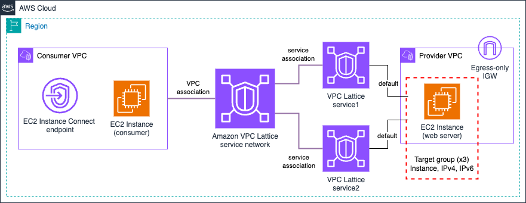

# Amazon VPC Lattice - EC2 Instance & IP target type

## Prerequisites
- An AWS account with an IAM user with the appropriate permissions

## Usage
- Clone the repository.
- Provide a value for the variables `CUSTOM_DOMAIN_NAME`, `CERTIFICATE_ARN`, and `HOSTED_ZONE_NAME` under the Makefile to test the creation of a VPC Lattice service with a custom domain name.
- Deploy the resources using `make deploy`.
- Remember to clean up resoures once you are done by using `make undeploy`.

**Note** EC2 instances will be deployed in all the Availability Zones configured for each VPC. Keep this in mind when testing this environment from a cost perspective - for production environments, we recommend the use of at least 2 AZs for high-availability.