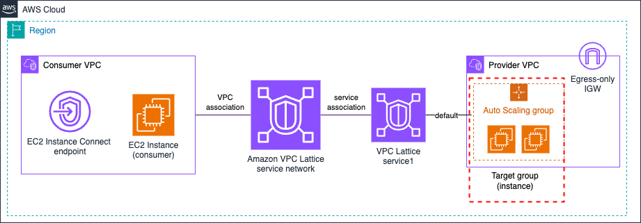

# Amazon VPC Lattice - Auto Scaling Group Target (AWS CloudFormation)



## Prerequisites

- **AWS Account**: With appropriate IAM permissions
- **AWS CLI**: Installed and configured with credentials
- **Permissions required**:
  - CloudFormation
  - VPC Lattice
  - EC2: VPC, subnets, instances, security groups, Auto Scaling groups
  - IAM: Create roles and policies
- **Make**: Installed

## Deployment

```bash
# Clone the repository
git clone https://github.com/aws-samples/amazon-vpc-lattice-blueprints.git

# Navigate to the CloudFormation directory
cd patterns/1-simple_architectures/2-auto_scaling_group/cloudformation

# Deploy everything (Networking + Consumer + Provider)
make deploy

# Or deploy step-by-step:
make deploy-sn                 # Deploy service network first
make deploy-consumer-provider  # Then deploy consumer VPC and instances, provider VPC, Auto Scaling group, and service
```

> **Note**: The Auto Scaling group will deploy EC2 instances in all configured Availability Zones. Keep this in mind when testing this environment from a cost perspective - for production environments, we recommend the use of at least 2 AZs for high-availability.

## Cleanup

```bash
# Delete everything
make undeploy
```

## Testing

After successful deployment, follow the testing instructions in the [Testing Connectivity](../README.md#testing-connectivity-1) section of the Auto Scaling Group pattern documentation.

## Next Steps

After successfully deploying this pattern:

1. **Test connectivity**: Follow the testing guide to verify the service works correctly
2. **Explore other targets**: Try [EC2 Instance](../../1-ec2_instance/), [Lambda](../../3-lambda_function/), or [ECS](../../4-ecs/) patterns
3. **Multi-Account**: Move to [Multi-Account patterns](../../../2-multi_account/) for cross-account deployments
4. **Advanced architectures**: Explore [Advanced patterns](../../../3-advanced_architectures/) for more complex scenarios
