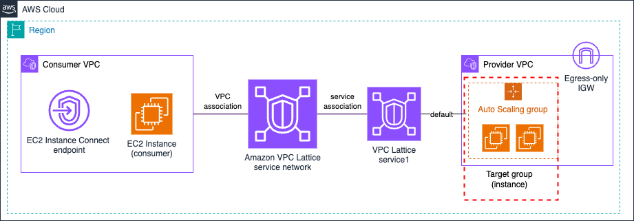

# Amazon VPC Lattice Blueprints - Simple architectures

Within this section of the blueprints, we will cover a simple architecture: a consumer EC2 instance in a VPC consuming a VPC Lattice service or VPC resource in another VPC. You will find three different example types:

1. VPC Lattice targets - showing how to target different compute capacities using VPC Lattice:
    * [EC2 instances](./1-ec2_instance/) (using `INSTANCE` and `IP` target types)
    * [Auto-scaling group.](./2-auto_scaling_group/)
    * AWS Lambda function.
    * Amazon ECS.
    * Amazon EKS.
2. VPC resource configurations - showing how you can consume VPC resources (TCP) using VPC Lattice:
    * Amazon RDS instance.
3. Specific VPC Lattice configurations:
    * VPC Lattice custom domain name.

**All examples are configured to be deployed in a single AWS Account**. For multi-AWS Account examples, please check the [Multi-account patterns](../2-multi_account/).

## EC2 instance (using instance and IP target)

In this example, EC2 instances (1 per AZ) are the VPC Lattice targets. The following resources are created:

* Consumer VPC with EC2 instances (1 per AZ) as consumers, and an [EC2 Instance Connect endpoint](https://docs.aws.amazon.com/AWSEC2/latest/UserGuide/connect-using-eice.html) to access the consumer instances.
* Provider VPC with EC2 instances (1 per AZ) as web servers.
* VPC Lattice resources:
    * 3 target groups, all them targeting the same EC2 instances. The difference is the target type: `INSTANCE` (target1), `IPv4` (target2), and `IPv6` (target3).
    * 2 VPC Lattice services with HTTPS listener. One of the services (`service1`) with a default forward action to `target1` (100% weight), and the other service (`service2`) with another default action to `target2` and `target3` (50% weight each).

**Note**: An [egress-only Internet gateway](https://docs.aws.amazon.com/vpc/latest/userguide/egress-only-internet-gateway.html) is created in the provider VPC to allow the EC2 instances to install the packages needed to be configured as web servers. IPv6 is used to not have any extra infrastructure cost (NAT gateways), and provide an easy configure for egress access.

## Auto-scaling group

In this example, an [Auto-scaling group](https://docs.aws.amazon.com/autoscaling/ec2/userguide/auto-scaling-groups.html) is the VPC Lattice target. The following resources are created:

* Consumer VPC with EC2 instances (1 per AZ) as consumers, and an [EC2 Instance Connect endpoint](https://docs.aws.amazon.com/AWSEC2/latest/UserGuide/connect-using-eice.html) to access the consumer instances.
* Provider VPC with an Auto-scaling group deploying 2 EC2 instances as web servers (1 in each AZ). The Auto-scaling group is associated to the VPC Lattice target group using the [attach-traffic-sources](https://docs.aws.amazon.com/cli/latest/reference/autoscaling/attach-traffic-sources.html) action.
* VPC Lattice resources:
    * 1 target groups type `INSTANCE`.
    * 1 VPC Lattice services with HTTPS listener. The listener has a default forward action sending all the traffic to the only target group created.

