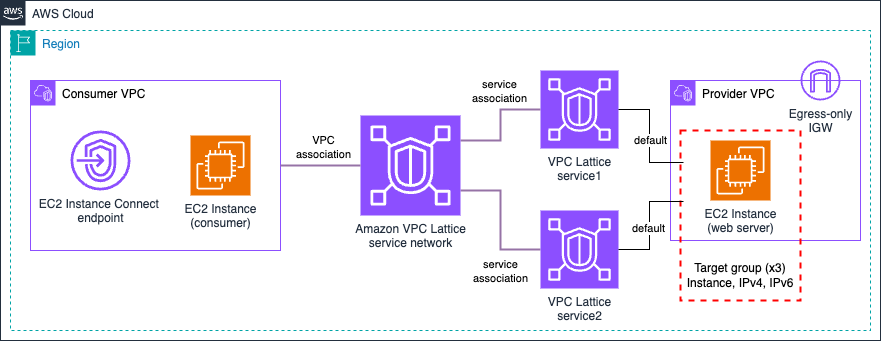

# Amazon VPC Lattice Blueprints - Simple Architectures

## Overview

This pattern demonstrates the fundamental concepts of Amazon VPC Lattice through straightforward single-account architectures. It's designed as an entry point for understanding service networks, services, target groups, and VPC associations.

**Use this pattern to**:

- Learn VPC Lattice basics in a hands-on environment.
- Understand different target types in VPC Lattice (EC2 instances, Auto Scaling groups, Lambda functions, ECS, EKS) and VPC resources (RDS).
- Test service-to-service communication patterns.
- Build a foundation for more complex patterns.

> **Note**: All examples are configured to be deployed in a single AWS Account. For multi-AWS Account examples, see the [Multi-Account Patterns](../2-multi_account/) section.

## Architecture Patterns

This section includes multiple sub-patterns demonstrating different VPC Lattice target types:

| Pattern | Description | IaC Support |
|---------|-------------|-------------|
| [1. EC2 Instance](./1-ec2_instance/) | EC2 instances as targets using INSTANCE and IP target types | CloudFormation, Terraform |
| [2. Auto Scaling Group](./2-auto_scaling_group/) | Auto Scaling group as target with automatic instance registration | CloudFormation, Terraform |
| [3. Lambda Function](./3-lambda_function/) | AWS Lambda function as serverless target | CloudFormation, Terraform |
| [4. ECS](./4-ecs/) | Amazon ECS tasks as containerized targets | CloudFormation, Terraform |
| 5. EKS | Amazon EKS pods as Kubernetes-based targets | Coming Soon |
| 6. RDS | Amazon RDS database as VPC resource (TCP connectivity) | Coming Soon |

### Common Architecture Components

All patterns share these core components:

| Component | Configuration |
|-----------|---------------|
| **AWS Region** | eu-west-1 (configurable) |
| **Consumer VPC** | VPC with EC2 instances to test service consumption |
| **Provider VPC** | VPC hosting the target resources |
| **Service Network** | VPC Lattice service network connecting consumer and provider |

---

## 1. EC2 Instance

### What gets deployed

| Component | Details |
|-----------|---------|
| **Consumer VPC** | EC2 instances (1 per AZ) with EC2 Instance Connect endpoint for remote access |
| **Provider VPC** | EC2 instances (1 per AZ) configured as web servers |
| **Target Groups** | 3 target groups: INSTANCE type, IPv4 type, IPv6 type |
| **VPC Lattice Services** | 2 services with HTTPS listeners and different routing configurations |



### VPC Lattice Services Configuration

This pattern creates two VPC Lattice services to demonstrate different target types and routing configurations:

| Aspect | Service 1 | Service 2 |
|--------|-----------|-----------|
| **Custom Domain Name** | ❌ No (uses VPC Lattice-generated FQDN) | ✅ Yes (configurable via variables) |
| **Certificate** | ❌ VPC Lattice-managed | ✅ ACM certificate (configurable via variables) |
| **Private Hosted Zone** | ❌ Not required | ✅ Route 53 private hosted zone for DNS resolution |
| **Listener** | HTTPS on port 443 | HTTPS on port 443 |
| **Target Groups** | `instancetarget` (INSTANCE type) | `ipv4target` (IPv4 IP type) + `ipv6target` (IPv6 IP type) |
| **Routing** | 100% traffic to INSTANCE target group | 50% traffic to IPv4 targets, 50% to IPv6 targets |
| **Targets** | 2 EC2 instances (by instance ID) on port 80 | Same 2 EC2 instances (by IP address) on port 80 |
| **Backend Protocol** | HTTP | HTTP |

**Key Differences**:
- **Service 1** uses instance IDs (INSTANCE target type) and VPC Lattice-generated domain
- **Service 2** uses IP addresses (IP target type) with both IPv4 and IPv6, plus custom domain name
- Both services target the same EC2 instances but demonstrate different targeting methods

> **Note**: An egress-only Internet gateway is created in the provider VPC to allow EC2 instances to install packages. IPv6 is used to avoid NAT gateway costs while providing egress access.

### Implementation

| IaC Tool | Location |
|----------|----------|
| **CloudFormation** | [`./1-ec2_instance/cloudformation/`](./1-ec2_instance/cloudformation/) |
| **Terraform** | [`./1-ec2_instance/terraform/`](./1-ec2_instance/terraform/) |

### Testing Connectivity

<details>
<summary>Click to expand testing steps</summary>

#### Step 1: Connect to Consumer Instance

Use EC2 Instance Connect endpoint to access a consumer instance:

> **Note**: Consumer EC2 instance IDs are provided as outputs when deploying the CloudFormation or Terraform code. Check the deployment outputs to get the instance IDs.

```bash
aws ec2-instance-connect ssh --instance-id <consumer-instance-id>
```

#### Step 2: Test DNS Resolution

Verify VPC Lattice DNS resolution for both services:

> **Note**: Both service domain names are provided as outputs when deploying the CloudFormation or Terraform code. Check the deployment outputs to get the exact domain names.

| Service | Command | Expected Result |
|---------|---------|-----------------|
| **Service 1** | `dig <service1-domain-name>` | Link-local address (169.254.171.X) indicating VPC Lattice routing |
| **Service 2** | `dig <custom-domain-name>` | Link-local address (169.254.171.X) - ALIAS record configured |


#### Step 3: Test HTTPS Connectivity

Test connectivity to both services using the same curl command with their respective domain names:

```bash
# Service 1 (VPC Lattice-generated domain)
curl https://<service1-domain-name>

# Service 2 (Custom domain name)
curl https://<custom-domain-name>
```

**Expected Response**: 
- "Hello from EC2 instance"
- Request IP address (VPC Lattice IP - IPv4 or IPv6 depending on which target group was used)


#### Step 4: Test Load Distribution

Verify traffic distribution patterns for each service:

| Service | Command | Expected Distribution |
|---------|---------|----------------------|
| **Service 1** | `for i in {1..10}; do curl https://<service1-domain-name>; echo ""; done` | 100% to INSTANCE target group (distributed across 2 EC2 instances) |
| **Service 2** | `for i in {1..20}; do curl https://<custom-domain-name>; echo ""; done` | 50% to IPv4 targets, 50% to IPv6 targets (same 2 EC2 instances) |

#### Step 5: Verify Target Health

Check that all targets are healthy in the AWS Console:

1. Navigate to **VPC → VPC Lattice → Target groups**
2. Select each target group: `instancetarget`, `ipv4target`, `ipv6target`
3. Verify all targets show **"Healthy"** status


</details>

---

## 2. Auto Scaling Group

### What gets deployed

| Component | Details |
|-----------|---------|
| **Consumer VPC** | EC2 instances (1 per AZ) with EC2 Instance Connect endpoint for remote access |
| **Provider VPC** | Auto Scaling group with 2 EC2 instances (1 per AZ) configured as web servers |
| **Target Group** | 1 INSTANCE type target group |
| **VPC Lattice Service** | 1 service with HTTPS listener forwarding to Auto Scaling group |


### VPC Lattice Service Configuration

This pattern creates one VPC Lattice service demonstrating Auto Scaling group integration:

| Aspect | Configuration |
|--------|---------------|
| **Custom Domain Name** | ❌ No (uses VPC Lattice-generated FQDN) |
| **Certificate** | ❌ VPC Lattice-managed |
| **Listener** | HTTPS on port 443 |
| **Target Group** | `asg-target` (INSTANCE type) |
| **Routing** | 100% traffic to Auto Scaling group instances |
| **Targets** | Auto Scaling group (automatic instance registration/deregistration) |
| **Backend Protocol** | HTTP |

**Key Feature**: The Auto Scaling group is associated with the VPC Lattice target group using the `attach-traffic-sources` action, enabling automatic instance registration and deregistration as the group scales.

> **Note**: An egress-only Internet gateway is created in the provider VPC to allow EC2 instances to install packages. IPv6 is used to avoid NAT gateway costs while providing egress access.

### Implementation

| IaC Tool | Location |
|----------|----------|
| **CloudFormation** | [`./2-auto_scaling_group/cloudformation/`](./2-auto_scaling_group/cloudformation/) |
| **Terraform** | [`./2-auto_scaling_group/terraform/`](./2-auto_scaling_group/terraform/) |

### Testing Connectivity

<details>
<summary>Click to expand testing steps</summary>

#### Step 1: Connect to Consumer Instance

Use EC2 Instance Connect endpoint to access a consumer instance:

> **Note**: Consumer EC2 instance IDs are provided as outputs when deploying the CloudFormation or Terraform code. Check the deployment outputs to get the instance IDs.

```bash
aws ec2-instance-connect ssh --instance-id <consumer-instance-id>
```

#### Step 2: Test DNS Resolution

Verify VPC Lattice DNS resolution:

> **Note**: The service domain name is provided as an output when deploying the CloudFormation or Terraform code. Check the deployment outputs to get the exact domain name.

```bash
dig <service-domain-name>
```

**Expected Result**: Link-local address (169.254.171.X) indicating VPC Lattice routing


#### Step 3: Test HTTPS Connectivity

Test connectivity to the service:

```bash
curl https://<service-domain-name>
```

**Expected Response**: 
- "Hello from the AutoScaling Group!!"
- Request IP address (VPC Lattice IP showing which instance handled the request)


#### Step 4: Verify Target Health

Check that all Auto Scaling group instances are healthy:

1. Navigate to **VPC → VPC Lattice → Target groups**
2. Select the `asg-target` target group
3. Verify all instances show **"Healthy"** status


</details>

---

## 3. Lambda Function

### What gets deployed

| Component | Details |
|-----------|---------|
| **Consumer VPC** | EC2 instances (1 per AZ) with EC2 Instance Connect endpoint for remote access |
| **Lambda Function** | Serverless function responding to HTTP requests |
| **Target Group** | 1 LAMBDA type target group |
| **VPC Lattice Service** | 1 service with HTTPS listener forwarding to Lambda |


### VPC Lattice Service Configuration

This pattern creates one VPC Lattice service demonstrating Lambda function integration:

| Aspect | Configuration |
|--------|---------------|
| **Custom Domain Name** | ❌ No (uses VPC Lattice-generated FQDN) |
| **Certificate** | ❌ VPC Lattice-managed |
| **Listener** | HTTPS on port 443 |
| **Target Group** | `lambda-target` (LAMBDA type) |
| **Routing** | 100% traffic to Lambda function |
| **Target** | AWS Lambda function |
| **Backend Protocol** | N/A (Lambda invocation) |

### Implementation

| IaC Tool | Location |
|----------|----------|
| **CloudFormation** | [`./3-lambda_function/cloudformation/`](./3-lambda_function/cloudformation/) |
| **Terraform** | [`./3-lambda_function/terraform/`](./3-lambda_function/terraform/) |

### Testing Connectivity

<details>
<summary>Click to expand testing steps</summary>

#### Step 1: Connect to Consumer Instance

Use EC2 Instance Connect endpoint to access a consumer instance:

> **Note**: Consumer EC2 instance IDs are provided as outputs when deploying the CloudFormation or Terraform code. Check the deployment outputs to get the instance IDs.

```bash
aws ec2-instance-connect ssh --instance-id <consumer-instance-id>
```

#### Step 2: Test DNS Resolution

Verify VPC Lattice DNS resolution:

> **Note**: The service domain name is provided as an output when deploying the CloudFormation or Terraform code. Check the deployment outputs to get the exact domain name.

```bash
dig <service-domain-name>
```


**Expected Result**: Link-local address (169.254.171.X) indicating VPC Lattice routing

#### Step 3: Test HTTPS Connectivity

Test connectivity to the Lambda function through VPC Lattice:

```bash
curl https://<service-domain-name>
```

**Expected Response** (JSON format):
```json
{
  "message": "Hello from Lambda Function!!",
  "request_ip": "169.254.171.X"
}
```


</details>

---

## 4. ECS Fargate

### What gets deployed

| Component | Details |
|-----------|---------|
| **Consumer VPC** | EC2 instances (1 per AZ) with EC2 Instance Connect endpoint for remote access |
| **Provider VPC** | ECS Fargate cluster with containerized application |
| **ECR Repository** | Amazon ECR repository for Docker images |
| **Target Group** | 1 IP type target group |
| **VPC Lattice Service** | 1 service with HTTPS listener forwarding to ECS tasks |
| **VPC Endpoints** | ECR API, ECR DKR, S3 Gateway, and CloudWatch Logs endpoints |


### VPC Lattice Service Configuration

This pattern creates one VPC Lattice service demonstrating ECS Fargate integration:

| Aspect | Configuration |
|--------|---------------|
| **Custom Domain Name** | ❌ No (uses VPC Lattice-generated FQDN) |
| **Certificate** | ❌ VPC Lattice-managed |
| **Listener** | HTTPS on port 443 |
| **Target Group** | `ecstarget` (IP type) |
| **Routing** | 100% traffic to ECS tasks |
| **Targets** | ECS Fargate tasks (automatically registered) |
| **Backend Protocol** | HTTP on port 80 |

### Implementation

| IaC Tool | Location |
|----------|----------|
| **CloudFormation** | [`./4-ecs/cloudformation/`](./4-ecs/cloudformation/) |
| **Terraform** | [`./4-ecs/terraform/`](./4-ecs/terraform/) |

### Testing Connectivity

<details>
<summary>Click to expand testing steps</summary>

#### Step 1: Connect to Consumer Instance

Use EC2 Instance Connect endpoint to access a consumer instance:

> **Note**: Consumer EC2 instance IDs are provided as outputs when deploying the CloudFormation or Terraform code. Check the deployment outputs to get the instance IDs.

```bash
aws ec2-instance-connect ssh --instance-id <consumer-instance-id>
```

#### Step 2: Test DNS Resolution

Verify VPC Lattice DNS resolution:

> **Note**: The service domain name is provided as an output when deploying the CloudFormation or Terraform code. Check the deployment outputs to get the exact domain name.

```bash
dig <service-domain-name>
```

**Expected Result**: Link-local address (169.254.171.X) indicating VPC Lattice routing


#### Step 3: Test HTTPS Connectivity

Test connectivity to the ECS Fargate service through VPC Lattice:

```bash
curl https://<service-domain-name>
```

**Expected Response** (JSON format):
```json
{
  "message": "Hello from ECS Fargate!!",
  "request_ip": "169.254.171.X"
}
```


#### Step 4: Verify Target Health

Check that ECS tasks are healthy:

1. Navigate to **VPC → VPC Lattice → Target groups**
2. Select the `ecstarget` target group
3. Verify ECS task IPs show **"Healthy"** status


</details>

---

## Troubleshooting

### Cannot connect to service

**Check**:

1. VPC associations are in "Active" state
2. Service association is in "Active" state
3. Target health checks are passing
4. Security groups allow required traffic
5. VPC route tables have routes to VPC Lattice

### DNS resolution fails

**Check**:

1. VPC has DNS resolution enabled
2. VPC has DNS hostnames enabled
3. Service network VPC association is active

### Target health checks failing

**Check**:

1. Target instances/functions are running
2. Security groups allow health check traffic
3. Health check path and port are correct
4. Application is responding on the configured port

## Next Steps

After mastering these simple architectures, explore:

1. **[Multi-Account Patterns](../2-multi_account/)** - Deploy across multiple AWS accounts
2. **[Advanced Architectures](../3-advanced_architectures/)** - Implement hybrid connectivity and cross-Region patterns
